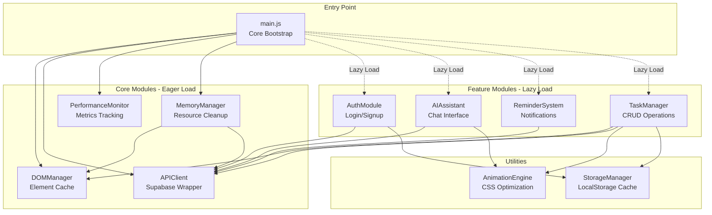

# Performance Optimization Design Document

## Overview

This design document outlines the performance optimization strategy for the TaskFlow todo list application. The current application suffers from significant performance issues stemming from a monolithic 3250-line JavaScript file, excessive DOM queries, unoptimized API calls, and potential memory leaks. This design addresses these issues through a comprehensive refactoring that includes code splitting, DOM caching, API optimization, animation improvements, and memory management.

The optimization strategy focuses on five key areas:

1. **Module Architecture**: Breaking the monolithic main.js into feature-based modules with lazy loading
2. **DOM Management**: Implementing a centralized DOM manager with element caching
3. **API Optimization**: Creating a wrapper client with debouncing, batching, and retry logic
4. **Animation Performance**: Optimizing CSS animations to use GPU-accelerated properties
5. **Memory Management**: Implementing systematic cleanup of resources and event listeners

The target outcomes are:
- Initial bundle size < 100KB (uncompressed)
- Page load time reduction of 40-60%
- Elimination of memory leaks during extended sessions
- Smooth 60fps animations
- Reduced API call volume by 30-50%

## Architecture

### High-Level Architecture



### Module Boundaries

The application will be split into the following modules:

**Core Modules (Eager Loaded)**:
- `main.js` (15-20KB): Application bootstrap, routing, core initialization
- `DOMManager.js` (5-8KB): DOM element caching and query optimization
- `APIClient.js` (8-12KB): Supabase wrapper with retry, debounce, batch logic
- `PerformanceMonitor.js` (3-5KB): Metrics collection and reporting
- `MemoryManager.js` (4-6KB): Resource cleanup registry

**Feature Modules (Lazy Loaded)**:
- `AuthModule.js` (12-15KB): Authentication, login, signup, profile management
- `AIAssistant.js` (15-20KB): AI chat interface and Cerebras API integration
- `ReminderSystem.js` (10-12KB): Reminder creation, notifications, scheduling
- `TaskManager.js` (20-25KB): Task CRUD, filtering, sorting, drag-and-drop

**Utility Modules**:
- `AnimationEngine.js` (3-5KB): CSS animation helpers and will-change management
- `StorageManager.js` (5-7KB): LocalStorage wrapper with compression and debouncing

### Loading Strategy

```javascript
// main.js - Core bootstrap
import { DOMManager } from './core/DOMManager.js'
import { APIClient } from './core/APIClient.js'
import { PerformanceMonitor } from './core/PerformanceMonitor.js'
import { MemoryManager } from './core/MemoryManager.js'

// Lazy load features on demand
const loadAuth = () => import('./features/AuthModule.js')
const loadAI = () => import('./features/AIAssistant.js')
const loadReminders = () => import('./features/ReminderSystem.js')
const loadTasks = () => import('./features/TaskManager.js')
```

## Components and Interfaces

### DOMManager

The DOMManager provides centralized DOM element caching and query optimization.

**Responsibilities**:
- Cache frequently accessed DOM elements on initialization
- Provide type-safe accessors for cached elements
- Validate element existence before returning references
- Update cache when DOM structure changes
- Implement event delegation for dynamic elements

**Interface**:

```typescript
interface DOMManager {
  // Initialization
  init(): void
  refresh(): void
  
  // Element access
  get(elementId: string): HTMLElement | null
  getAll(selector: string): NodeList
  
  // Event delegation
  delegate(parent: string, selector: string, event: string, handler: Function): void
  undelegate(parent: string, event: string): void
  
  // Cache management
  invalidate(elementId: string): void
  validate(): boolean
}
```

**Implementation Details**:

```javascript
class DOMManager {
  constructor() {
    this.cache = new Map()
    this.delegatedEvents = new Map()
    this.init()
  }
  
  init() {
    // Cache critical elements
    const criticalIds = [
      'taskList', 'sidebar', 'taskModal', 'aiPanel',
      'deleteModal', 'authModal', 'notificationToast'
    ]
    
    criticalIds.forEach(id => {
      const el = document.getElementById(id)
      if (el) this.cache.set(id, el)
    })
  }
  
  get(elementId) {
    if (this.cache.has(elementId)) {
      const el = this.cache.get(elementId)
      // Validate element still in DOM
      if (document.contains(el)) return el
      this.cache.delete(elementId)
    }
    
    const el = document.getElementById(elementId)
    if (el) this.cache.set(elementId, el)
    return el
  }
  
  delegate(parentId, selector, event, handler) {
    const parent = this.get(parentId)
    if (!parent) return
    
    const wrappedHandler = (e) => {
      const target = e.target.closest(selector)
      if (target) handler.call(target, e)
    }
    
    parent.addEventListener(event, wrappedHandler)
    
    const key = `${parentId}:${event}`
    if (!this.delegatedEvents.has(key)) {
      this.delegatedEvents.set(key, [])
    }
    this.delegatedEvents.get(key).push({ selector, handler: wrappedHandler })
  }
}
```

### APIClient

The APIClient wraps Supabase calls with optimization features.

**Responsibilities**:
- Debounce rapid API requests
- Batch multiple requests for the same resource
- Implement exponential backoff retry logic
- Cache GET request responses
- Handle authentication token refresh

**Interface**:

```typescript
interface APIClient {
  // CRUD operations
  get(table: string, query: object, options?: RequestOptions): Promise<any>
  post(table: string, data: object, options?: RequestOptions): Promise<any>
  patch(table: string, id: string, data: object, options?: RequestOptions): Promise<any>
  delete(table: string, id: string, options?: RequestOptions): Promise<any>
  
  // Batch operations
  batchGet(table: string, ids: string[]): Promise<any[]>
  batchPost(table: string, items: object[]): Promise<any[]>
  
  // Cache management
  clearCache(table?: string): void
  
  // Configuration
  setDebounceDelay(ms: number): void
  setRetryConfig(maxRetries: number, baseDelay: number): void
}

interface RequestOptions {
  debounce?: boolean
  cache?: boolean
  cacheTTL?: number
  retries?: number
}
```

**Implementation Details**:

```javascript
class APIClient {
  constructor(supabaseUrl, supabaseKey) {
    this.url = supabaseUrl
    this.key = supabaseKey
    this.cache = new Map()
    this.pendingRequests = new Map()
    this.debounceTimers = new Map()
    this.debounceDelay = 300
    this.maxRetries = 3
    this.baseRetryDelay = 1000
  }
  
  async get(table, query, options = {}) {
    const cacheKey = `${table}:${JSON.stringify(query)}`
    
    // Check cache
    if (options.cache !== false && this.cache.has(cacheKey)) {
      const cached = this.cache.get(cacheKey)
      if (Date.now() - cached.timestamp < (options.cacheTTL || 60000)) {
        return cached.data
      }
    }
    
    // Debounce if requested
    if (options.debounce) {
      return this.debounceRequest(cacheKey, () => 
        this.executeGet(table, query, cacheKey, options)
      )
    }
    
    return this.executeGet(table, query, cacheKey, options)
  }
  
  debounceRequest(key, fn) {
    return new Promise((resolve, reject) => {
      if (this.debounceTimers.has(key)) {
        clearTimeout(this.debounceTimers.get(key).timer)
      }
      
      const timer = setTimeout(async () => {
        try {
          const result = await fn()
          this.debounceTimers.get(key).resolve(result)
        } catch (error) {
          this.debounceTimers.get(key).reject(error)
        }
        this.debounceTimers.delete(key)
      }, this.debounceDelay)
      
      this.debounceTimers.set(key, { timer, resolve, reject })
    })
  }
  
  async executeGet(table, query, cacheKey, options) {
    const url = this.buildUrl(table, query)
    const data = await this.fetchWithRetry(url, { method: 'GET' }, options.retries)
    
    // Cache result
    if (options.cache !== false) {
      this.cache.set(cacheKey, { data, timestamp: Date.now() })
    }
    
    return data
  }
  
  async fetchWithRetry(url, fetchOptions, maxRetries = this.maxRetries) {
    let lastError
    
    for (let attempt = 0; attempt <= maxRetries; attempt++) {
      try {
        const response = await fetch(url, {
          ...fetchOptions,
          headers: {
            'apikey': this.key,
            'Authorization': `Bearer ${localStorage.getItem('authToken')}`,
            'Content-Type': 'application/json'
          }
        })
        
        if (!response.ok) {
          throw new Error(`HTTP ${response.status}`)
        }
        
        return await response.json()
      } catch (error) {
        lastError = error
        
        if (attempt < maxRetries) {
          const delay = this.baseRetryDelay * Math.pow(2, attempt)
          await new Promise(resolve => setTimeout(resolve, delay))
        }
      }
    }
    
    throw lastError
  }
  
  async batchGet(table, ids) {
    // Batch multiple ID lookups into single query
    const query = { id: { in: ids } }
    return this.get(table, query)
  }
}
```

### PerformanceMonitor

Tracks and reports performance metrics without impacting user experience.

**Responsibilities**:
- Track page load time using Navigation Timing API
- Measure time-to-interactive using Performance Observer
- Track operation durations for key user actions
- Log metrics in development mode
- Provide performance budget warnings

**Interface**:

```typescript
interface PerformanceMonitor {
  // Initialization
  init(): void
  
  // Metrics tracking
  markStart(label: string): void
  markEnd(label: string): number
  measure(label: string, startMark: string, endMark: string): number
  
  // Reporting
  getMetrics(): PerformanceMetrics
  logMetrics(): void
  
  // Budget monitoring
  setBudget(operation: string, maxMs: number): void
  checkBudget(operation: string, actualMs: number): boolean
}

interface PerformanceMetrics {
  pageLoad: number
  timeToInteractive: number
  operations: Map<string, number[]>
  budgetViolations: string[]
}
```

**Implementation Details**:

```javascript
class PerformanceMonitor {
  constructor() {
    this.metrics = {
      pageLoad: 0,
      timeToInteractive: 0,
      operations: new Map(),
      budgetViolations: []
    }
    this.budgets = new Map()
    this.init()
  }
  
  init() {
    // Track page load
    if (window.performance && window.performance.timing) {
      window.addEventListener('load', () => {
        const timing = performance.timing
        this.metrics.pageLoad = timing.loadEventEnd - timing.navigationStart
      })
    }
    
    // Track time to interactive
    if ('PerformanceObserver' in window) {
      const observer = new PerformanceObserver((list) => {
        for (const entry of list.getEntries()) {
          if (entry.name === 'first-input') {
            this.metrics.timeToInteractive = entry.startTime
          }
        }
      })
      observer.observe({ entryTypes: ['first-input'] })
    }
  }
  
  markStart(label) {
    performance.mark(`${label}-start`)
  }
  
  markEnd(label) {
    performance.mark(`${label}-end`)
    const duration = this.measure(label, `${label}-start`, `${label}-end`)
    
    if (!this.metrics.operations.has(label)) {
      this.metrics.operations.set(label, [])
    }
    this.metrics.operations.get(label).push(duration)
    
    // Check budget
    if (this.budgets.has(label)) {
      this.checkBudget(label, duration)
    }
    
    return duration
  }
  
  measure(label, startMark, endMark) {
    performance.measure(label, startMark, endMark)
    const measure = performance.getEntriesByName(label)[0]
    return measure.duration
  }
  
  checkBudget(operation, actualMs) {
    const budget = this.budgets.get(operation)
    if (actualMs > budget) {
      const violation = `${operation}: ${actualMs.toFixed(2)}ms (budget: ${budget}ms)`
      this.metrics.budgetViolations.push(violation)
      console.warn(`⚠️ Performance budget exceeded: ${violation}`)
      return false
    }
    return true
  }
  
  logMetrics() {
    if (import.meta.env.DEV) {
      console.group('📊 Performance Metrics')
      console.log(`Page Load: ${this.metrics.pageLoad}ms`)
      console.log(`Time to Interactive: ${this.metrics.timeToInteractive}ms`)
      
      console.group('Operations')
      this.metrics.operations.forEach((durations, label) => {
        const avg = durations.reduce((a, b) => a + b, 0) / durations.length
        console.log(`${label}: ${avg.toFixed(2)}ms avg (${durations.length} samples)`)
      })
      console.groupEnd()
      
      if (this.metrics.budgetViolations.length > 0) {
        console.group('⚠️ Budget Violations')
        this.metrics.budgetViolations.forEach(v => console.warn(v))
        console.groupEnd()
      }
      
      console.groupEnd()
    }
  }
}
```

### MemoryManager

Manages resource cleanup to prevent memory leaks.

**Responsibilities**:
- Track event listeners, intervals, and timeouts
- Provide cleanup registry for disposable resources
- Automatically clean up on component unmount
- Monitor memory usage patterns
- Clear notification and reminder references

**Interface**:

```typescript
interface MemoryManager {
  // Registration
  registerListener(element: HTMLElement, event: string, handler: Function): void
  registerInterval(id: number): void
  registerTimeout(id: number): void
  registerResource(key: string, cleanup: Function): void
  
  // Cleanup
  cleanup(scope?: string): void
  cleanupListeners(element: HTMLElement): void
  cleanupIntervals(): void
  cleanupTimeouts(): void
  
  // Monitoring
  getActiveResources(): ResourceReport
}

interface ResourceReport {
  listeners: number
  intervals: number
  timeouts: number
  customResources: number
}
```

**Implementation Details**:

```javascript
class MemoryManager {
  constructor() {
    this.listeners = new Map()
    this.intervals = new Set()
    this.timeouts = new Set()
    this.resources = new Map()
  }
  
  registerListener(element, event, handler, scope = 'global') {
    const key = `${scope}:${event}`
    if (!this.listeners.has(key)) {
      this.listeners.set(key, [])
    }
    this.listeners.get(key).push({ element, handler })
  }
  
  registerInterval(id, scope = 'global') {
    this.intervals.add({ id, scope })
  }
  
  registerTimeout(id, scope = 'global') {
    this.timeouts.add({ id, scope })
  }
  
  registerResource(key, cleanup, scope = 'global') {
    this.resources.set(`${scope}:${key}`, cleanup)
  }
  
  cleanup(scope = null) {
    // Clean listeners
    this.listeners.forEach((handlers, key) => {
      if (!scope || key.startsWith(scope)) {
        handlers.forEach(({ element, handler }) => {
          const [, event] = key.split(':')
          element.removeEventListener(event, handler)
        })
        this.listeners.delete(key)
      }
    })
    
    // Clean intervals
    this.intervals.forEach(({ id, scope: intervalScope }) => {
      if (!scope || intervalScope === scope) {
        clearInterval(id)
        this.intervals.delete({ id, scope: intervalScope })
      }
    })
    
    // Clean timeouts
    this.timeouts.forEach(({ id, scope: timeoutScope }) => {
      if (!scope || timeoutScope === scope) {
        clearTimeout(id)
        this.timeouts.delete({ id, scope: timeoutScope })
      }
    })
    
    // Clean custom resources
    this.resources.forEach((cleanup, key) => {
      if (!scope || key.startsWith(scope)) {
        cleanup()
        this.resources.delete(key)
      }
    })
  }
  
  getActiveResources() {
    return {
      listeners: Array.from(this.listeners.values()).reduce((sum, arr) => sum + arr.length, 0),
      intervals: this.intervals.size,
      timeouts: this.timeouts.size,
      customResources: this.resources.size
    }
  }
}
```

### AnimationEngine

Optimizes CSS animations for GPU acceleration.

**Responsibilities**:
- Apply will-change hints to animating elements
- Remove will-change after animation completes
- Provide animation helpers using transform/opacity
- Respect prefers-reduced-motion
- Limit continuous animations

**Interface**:

```typescript
interface AnimationEngine {
  // Animation control
  animate(element: HTMLElement, animation: Animation): Promise<void>
  cancel(element: HTMLElement): void
  
  // will-change management
  prepareAnimation(element: HTMLElement, properties: string[]): void
  cleanupAnimation(element: HTMLElement): void
  
  // Helpers
  fadeIn(element: HTMLElement, duration?: number): Promise<void>
  fadeOut(element: HTMLElement, duration?: number): Promise<void>
  slideIn(element: HTMLElement, direction: Direction, duration?: number): Promise<void>
  
  // Configuration
  respectReducedMotion(): boolean
}

interface Animation {
  keyframes: Keyframe[]
  options: KeyframeAnimationOptions
}
```

### StorageManager

Optimizes LocalStorage operations with debouncing and compression.

**Responsibilities**:
- Debounce write operations
- Serialize only changed data
- Cache parsed data in memory
- Compress large data structures
- Handle quota exceeded errors

**Interface**:

```typescript
interface StorageManager {
  // Read operations
  get(key: string): any
  getAll(): object
  
  // Write operations
  set(key: string, value: any, options?: StorageOptions): void
  setMultiple(items: object): void
  remove(key: string): void
  clear(): void
  
  // Cache management
  invalidateCache(key?: string): void
  
  // Quota management
  getUsage(): StorageUsage
  cleanup(): void
}

interface StorageOptions {
  debounce?: boolean
  compress?: boolean
}

interface StorageUsage {
  used: number
  available: number
  percentage: number
}
```

## Data Models

### Task Model

```typescript
interface Task {
  id: number
  title: string
  notes: string
  completed: boolean
  priority: 'low' | 'medium' | 'high'
  project: string
  dueDate: string // ISO date
  createdDate: string // ISO date
  completedDate: string | null // ISO date
  labels: string[]
  userId?: string // For authenticated users
}
```

### Reminder Model

```typescript
interface Reminder {
  id: number
  taskId: number
  datetime: string // ISO datetime
  notified: boolean
  userId?: string
}
```

### Performance Metrics Model

```typescript
interface PerformanceMetrics {
  pageLoad: number // ms
  timeToInteractive: number // ms
  operations: Map<string, number[]> // operation name -> durations
  budgetViolations: string[]
}
```

### Cache Entry Model

```typescript
interface CacheEntry<T> {
  data: T
  timestamp: number
  ttl: number
}
```


## Correctness Properties

A property is a characteristic or behavior that should hold true across all valid executions of a system—essentially, a formal statement about what the system should do. Properties serve as the bridge between human-readable specifications and machine-verifiable correctness guarantees.

### Property 1: Module Load Performance

For any lazy-loaded feature module, when a user triggers the loading action, the module SHALL be loaded and ready within 200ms.

**Validates: Requirements 1.5**

### Property 2: DOM Cache Identity

For any DOM element ID, when requested multiple times from the DOMManager without DOM modifications, all returned references SHALL be identical (same object reference).

**Validates: Requirements 2.3**

### Property 3: DOM Cache Validation

For any cached DOM element, when the element is removed from the document, the DOMManager SHALL detect this and either return null or re-query the element on the next access.

**Validates: Requirements 2.4**

### Property 4: API Request Batching

For any set of API requests to the same resource made within the batching window, the APIClient SHALL combine them into a single network request.

**Validates: Requirements 3.2**

### Property 5: API Retry Exhaustion

For any API request that consistently fails, the APIClient SHALL attempt the request exactly 4 times total (1 initial attempt + 3 retries) before returning an error.

**Validates: Requirements 3.4**

### Property 6: API Response Caching

For any GET request, when the same request is made within 60 seconds, the APIClient SHALL return the cached response without making a new network request.

**Validates: Requirements 3.5**

### Property 7: Animation will-change Lifecycle

For any element being animated, the AnimationEngine SHALL apply will-change hints at animation start and remove them at animation end.

**Validates: Requirements 4.2, 4.3**

### Property 8: Resource Cleanup Completeness

For any component scope, when cleanup is invoked, the MemoryManager SHALL remove all associated event listeners, intervals, and timeouts registered under that scope.

**Validates: Requirements 5.1, 5.2**

### Property 9: Event Listener Stability

For any task list re-render operation, the total count of root-level event listeners SHALL not increase.

**Validates: Requirements 6.3**

### Property 10: Performance Measurement

For any tracked operation, when the operation completes, the PerformanceMonitor SHALL have recorded a duration measurement for that operation.

**Validates: Requirements 7.3**

### Property 11: Module Load Error Handling

For any lazy-loaded module that fails to load, the Module_Loader SHALL display a user-friendly error message to the user.

**Validates: Requirements 8.5**

### Property 12: Storage Read Caching

For any LocalStorage key, when read multiple times without intervening writes, the StorageManager SHALL return the cached parsed data without re-parsing.

**Validates: Requirements 9.3**

## Error Handling

### Error Categories

The performance optimization system must handle several categories of errors:

1. **Module Loading Errors**: Failed dynamic imports
2. **API Errors**: Network failures, timeouts, authentication errors
3. **DOM Errors**: Missing elements, invalid selectors
4. **Storage Errors**: Quota exceeded, parse errors
5. **Animation Errors**: Invalid keyframes, unsupported properties

### Error Handling Strategy

**Module Loading Errors**:
```javascript
async function loadModule(modulePath) {
  try {
    const module = await import(modulePath)
    return module
  } catch (error) {
    console.error(`Failed to load module: ${modulePath}`, error)
    showNotification(
      'Failed to load feature. Please refresh the page.',
      '⚠️',
      5000
    )
    // Fallback to degraded functionality
    return null
  }
}
```

**API Errors**:
```javascript
async function handleAPIError(error, context) {
  if (error.status === 401) {
    // Token expired, try refresh
    const refreshed = await refreshSession()
    if (refreshed) {
      return 'retry'
    } else {
      // Force re-authentication
      showAuthModal()
      return 'auth_required'
    }
  } else if (error.status >= 500) {
    // Server error, retry with backoff
    return 'retry'
  } else if (error.status === 429) {
    // Rate limited, wait and retry
    return 'rate_limited'
  } else {
    // Client error, don't retry
    showNotification(`Error: ${error.message}`, '❌', 3000)
    return 'failed'
  }
}
```

**DOM Errors**:
```javascript
function safeGetElement(id) {
  const element = domManager.get(id)
  if (!element) {
    console.warn(`Element not found: ${id}`)
    // Attempt recovery
    domManager.refresh()
    return domManager.get(id)
  }
  return element
}
```

**Storage Errors**:
```javascript
function handleStorageError(error) {
  if (error.name === 'QuotaExceededError') {
    console.warn('LocalStorage quota exceeded, cleaning up...')
    storageManager.cleanup()
    // Retry operation
    return 'retry'
  } else if (error instanceof SyntaxError) {
    console.error('Failed to parse stored data, clearing cache')
    storageManager.clear()
    return 'cleared'
  } else {
    console.error('Storage error:', error)
    return 'failed'
  }
}
```

### Error Recovery

The system implements graceful degradation:

1. **Module Load Failure**: Continue with core functionality, disable failed feature
2. **API Failure**: Use cached data if available, queue operations for retry
3. **DOM Error**: Refresh cache, fall back to direct queries
4. **Storage Error**: Clear cache, operate in memory-only mode
5. **Animation Error**: Skip animation, show instant state change

### Error Reporting

In development mode, all errors are logged with full context:

```javascript
function logError(category, error, context) {
  if (import.meta.env.DEV) {
    console.group(`❌ ${category} Error`)
    console.error(error)
    console.log('Context:', context)
    console.trace()
    console.groupEnd()
  }
}
```

In production, errors are logged to a minimal format:

```javascript
function logProductionError(category, error) {
  console.error(`[${category}] ${error.message}`)
}
```

## Testing Strategy

### Dual Testing Approach

The performance optimization feature requires both unit testing and property-based testing to ensure comprehensive coverage:

**Unit Tests**: Verify specific examples, edge cases, and error conditions
- Specific module load scenarios
- DOM cache behavior with known elements
- API retry logic with mocked failures
- Animation lifecycle events
- Storage quota handling

**Property Tests**: Verify universal properties across all inputs
- Module load performance across all features
- DOM cache identity for any element
- API batching for any request set
- Resource cleanup for any scope
- Storage caching for any key

Both approaches are complementary and necessary. Unit tests catch concrete bugs in specific scenarios, while property tests verify general correctness across a wide range of inputs.

### Property-Based Testing Configuration

We will use **fast-check** as the property-based testing library for JavaScript/TypeScript.

Each property test must:
- Run a minimum of 100 iterations (due to randomization)
- Reference its corresponding design document property
- Use the tag format: **Feature: performance-optimization, Property {number}: {property_text}**

Example property test structure:

```javascript
import fc from 'fast-check'
import { describe, it, expect } from 'vitest'

describe('Performance Optimization Properties', () => {
  it('Property 2: DOM Cache Identity', () => {
    // Feature: performance-optimization, Property 2: DOM cache identity
    fc.assert(
      fc.property(
        fc.string({ minLength: 1 }), // element ID
        (elementId) => {
          // Setup: create element and add to DOM
          const element = document.createElement('div')
          element.id = elementId
          document.body.appendChild(element)
          
          // Initialize DOM manager
          const domManager = new DOMManager()
          
          // Test: multiple requests return same reference
          const ref1 = domManager.get(elementId)
          const ref2 = domManager.get(elementId)
          const ref3 = domManager.get(elementId)
          
          // Cleanup
          document.body.removeChild(element)
          
          // Assert: all references are identical
          return ref1 === ref2 && ref2 === ref3
        }
      ),
      { numRuns: 100 }
    )
  })
  
  it('Property 5: API Retry Exhaustion', () => {
    // Feature: performance-optimization, Property 5: API retry exhaustion
    fc.assert(
      fc.property(
        fc.string(), // table name
        fc.object(), // query params
        async (table, query) => {
          let attemptCount = 0
          
          // Mock fetch to always fail
          const originalFetch = global.fetch
          global.fetch = async () => {
            attemptCount++
            throw new Error('Network error')
          }
          
          const apiClient = new APIClient('url', 'key')
          
          try {
            await apiClient.get(table, query)
          } catch (error) {
            // Expected to fail
          }
          
          // Restore fetch
          global.fetch = originalFetch
          
          // Assert: exactly 4 attempts (1 initial + 3 retries)
          return attemptCount === 4
        }
      ),
      { numRuns: 100 }
    )
  })
})
```

### Unit Testing Strategy

Unit tests will focus on:

1. **Build Output Validation**:
   - Main bundle size < 100KB
   - Separate chunks exist for auth, AI, reminders
   - Source maps generated but not in bundle
   - Chunk size warnings for > 200KB

2. **Module Loading**:
   - Core CRUD in initial bundle
   - AI lazy loads on chat open
   - Auth lazy loads on login click
   - Reminders lazy load on first creation

3. **DOM Manager**:
   - Critical elements cached on init
   - Root listener count <= 20

4. **API Client**:
   - Debounce delay is 300ms
   - Exponential backoff: 1s, 2s, 4s
   - Cache TTL is 60 seconds

5. **Animation Engine**:
   - Reduced motion disables animations

6. **Memory Manager**:
   - Drag-and-drop cleanup removes listeners
   - Notification cleanup clears references

7. **Storage Manager**:
   - Debounce delay is 500ms
   - LRU cleanup on quota exceeded

8. **Performance Monitor**:
   - Page load time recorded
   - TTI recorded

Example unit test:

```javascript
import { describe, it, expect, beforeEach } from 'vitest'
import { APIClient } from './APIClient'

describe('APIClient', () => {
  let client
  
  beforeEach(() => {
    client = new APIClient('https://api.example.com', 'test-key')
  })
  
  it('should debounce requests with 300ms delay', async () => {
    // Feature: performance-optimization, Requirement 3.1
    const startTime = Date.now()
    
    // Make rapid requests
    const promises = [
      client.get('tasks', { id: 1 }, { debounce: true }),
      client.get('tasks', { id: 1 }, { debounce: true }),
      client.get('tasks', { id: 1 }, { debounce: true })
    ]
    
    await Promise.all(promises)
    const elapsed = Date.now() - startTime
    
    // Should wait at least 300ms
    expect(elapsed).toBeGreaterThanOrEqual(300)
  })
  
  it('should implement exponential backoff: 1s, 2s, 4s', async () => {
    // Feature: performance-optimization, Requirement 3.3
    const delays = []
    let lastTime = Date.now()
    
    // Mock fetch to fail and track delays
    global.fetch = async () => {
      const now = Date.now()
      if (delays.length > 0) {
        delays.push(now - lastTime)
      }
      lastTime = now
      throw new Error('Network error')
    }
    
    try {
      await client.get('tasks', {})
    } catch (error) {
      // Expected
    }
    
    // Check delays are approximately 1000ms, 2000ms, 4000ms
    expect(delays[0]).toBeGreaterThanOrEqual(900)
    expect(delays[0]).toBeLessThanOrEqual(1100)
    expect(delays[1]).toBeGreaterThanOrEqual(1900)
    expect(delays[1]).toBeLessThanOrEqual(2100)
    expect(delays[2]).toBeGreaterThanOrEqual(3900)
    expect(delays[2]).toBeLessThanOrEqual(4100)
  })
  
  it('should cache GET responses for 60 seconds', async () => {
    // Feature: performance-optimization, Requirement 3.5
    let fetchCount = 0
    
    global.fetch = async () => {
      fetchCount++
      return {
        ok: true,
        json: async () => ({ data: 'test' })
      }
    }
    
    // First request
    await client.get('tasks', { id: 1 })
    expect(fetchCount).toBe(1)
    
    // Second request within 60s should use cache
    await client.get('tasks', { id: 1 })
    expect(fetchCount).toBe(1)
    
    // After 60s should make new request
    await new Promise(resolve => setTimeout(resolve, 61000))
    await client.get('tasks', { id: 1 })
    expect(fetchCount).toBe(2)
  })
})
```

### Integration Testing

Integration tests will verify:
- Module loading triggers correct lazy imports
- DOM manager integrates with event delegation
- API client integrates with authentication refresh
- Memory manager integrates with component lifecycle
- Performance monitor integrates with all operations

### Performance Testing

Performance tests will validate:
- Initial bundle size targets
- Module load time < 200ms
- Page load time improvements
- Memory usage over extended sessions
- Animation frame rates

### Test Coverage Goals

- Unit test coverage: > 80%
- Property test coverage: All 12 properties
- Integration test coverage: All module interactions
- Performance test coverage: All budget constraints

